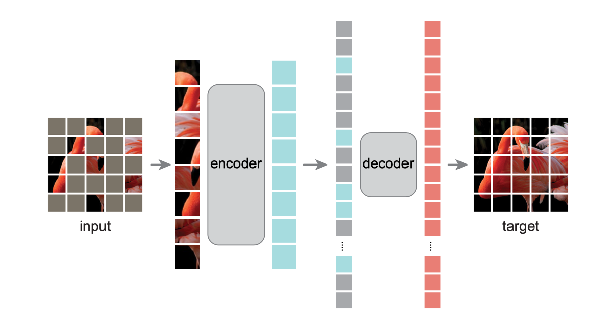

## MAE for Self-supervised ViT

## Introduction
This is an unofficial PyTorch implementation of [Masked Autoencoders Are Scalable Vision Learners](https://arxiv.org/abs/2111.06377) for self-supervised ViT. This repo is mainly based on [moco-v3](https://github.com/facebookresearch/moco-v3), [pytorch-image-models](https://github.com/rwightman/pytorch-image-models), [BEiT](https://github.com/microsoft/unilm/tree/master/beit) and [MAE-pytorch](https://github.com/pengzhiliang/MAE-pytorch).



## TODO

- [ ] visualization of reconstruction image
- [x] linear probing
- [x] k-NN classification
- [ ] more results
- [ ] more datasets
- [ ] transfer learning for detection and segmentation
- [ ] multi-nodes training
- [ ] ...

## Main Result

We support two representations (repre.) for classification: **GAP** (Global Average Pooling) and **Cls-token**. According to paper, MAE works similarily well with both of them. In Cls-token mode, it is trained in encoder of MAE.

### ViT-Small

| pretrain epoch | repre. | ft. top1 | k-NN |                            config                            |                            weight                            |                             log                              |
| :------------: | :----: | :------: | :--: | :----------------------------------------------------------: | :----------------------------------------------------------: | :----------------------------------------------------------: |
|      100       |  GAP   |  76.58%  |  -   | [pretrain](cfgs/pretrain/baseline_small/ViT-S_100E_Norm_GAP.yaml) [finetune](cfgs/finetune/ViT-S_50E_GAP.yaml) | [pretrain](https://drive.google.com/file/d/1FZ2ii8FtbO6TDIU9scEH85nVANOLQac1/view?usp=sharing) finetune | [pretrain](https://drive.google.com/file/d/1IuAqrz23PwaA1_B9bYYqD0P4cXAYf2ZE/view?usp=sharing) finetune |
|      200       |  GAP   |    -     |  -   | [pretrain](cfgs/pretrain/baseline_small/ViT-S_200E_Norm_GAP.yaml) [finetune](cfgs/finetune/ViT-S_50E_GAP.yaml) | [pretrain](https://drive.google.com/file/d/1ufbovFHqYhz78Usz01SQ3mNlL0NoqIjC/view?usp=sharing) finetune | [pretrain](https://drive.google.com/file/d/116tiw2HqXQxr4i0xU_ZRDa6IDLP3wvwy/view?usp=sharing) finetune |
|      400       |  GAP   |  77.56%  |  -   | [pretrain](cfgs/pretrain/baseline_small/ViT-S_400E_Norm_GAP.yaml) [finetune](cfgs/finetune/ViT-S_50E_GAP.yaml) | [pretrain](https://drive.google.com/file/d/1GEuNN4yYYkjnKJyh65GDoEfH5s1AOPYm/view?usp=sharing) [finetune](https://drive.google.com/file/d/1v7Iy_FtNpDK89aCsTkAOH3fGZixv_dVs/view?usp=sharing) | [pretrain](https://drive.google.com/file/d/1iBastCBVK6goDtjqXSILyuqtR0ppbCmo/view?usp=sharing) [finetune](https://drive.google.com/file/d/1T8titxifdMm55UOP7lkGc27g7UPj97Jh/view?usp=sharing) |
|      800       |  GAP   |    -     |  -   | [pretrain](cfgs/pretrain/baseline_small/ViT-S_800E_Norm_GAP.yaml) [finetune](cfgs/finetune/ViT-S_50E_GAP.yaml) | [pretrain](https://drive.google.com/file/d/1dmzysQ2phLcbNfrmuSdsK_I5ltokOVXk/view?usp=sharing) finetune | [pretrain](https://drive.google.com/file/d/17mPfUCclcCmWOmQneaNYTQQmYWl3T2U7/view?usp=sharing) finetune |
|      1600      |  GAP   |    -     |  -   | [pretrain](cfgs/pretrain/baseline_small/ViT-S_1600E_Norm_GAP.yaml) [finetune](cfgs/finetune/ViT-S_50E_GAP.yaml) |                      pretrain finetune                       |                      pretrain finetune                       |

- We finetune models by 50 epochs as default.
- [BaiduNetdisk](https://pan.baidu.com/s/1zc2JI_oJUS5l0hHcMIQa7w) （2lt1）

### ViT-Base

| pretrain epoch | repre. | ft. top1 | k-NN |                            config                            |                            weight                            |                             log                              |
| :------------: | :----: | :------: | :--: | :----------------------------------------------------------: | :----------------------------------------------------------: | :----------------------------------------------------------: |
|      400       |  GAP   |  83.08%  |  -   | [pretrain](cfgs/pretrain/ViT-B_400E_Norm_GAP.yaml) [finetune](cfgs/finetune/ViT-B_100E_GAP.yaml) | [pretrain](https://drive.google.com/file/d/1u3edwhpXYSQgi0FXKsI1dumWDOUICjIA/view?usp=sharing) [finetune](https://drive.google.com/file/d/15EzQAgSOb_LTPGRTM83QTrpvmpq5ONxc/view?usp=sharing) | [pretrain](https://drive.google.com/file/d/1tm0QaZaK9b2vcL8t4RRnUpO6OzQcBaL6/view?usp=sharing) [finetune](https://drive.google.com/file/d/1LYMRjcohw2BfFPTOtvNSq2ZxMhdoHpIT/view?usp=sharing) |

- We finetune models by 100 epochs as default.
- [BaiduNetdisk](https://pan.baidu.com/s/1W0Vl753XR9mkW3D75Hc7OA)  (k2ef)


## Usage

### Preparation

The code has been tested with CUDA 11.4, PyTorch 1.8.2.

#### Notes:
1. The batch size specified by `-b` is **batch-size per card**.
1. The learning rate specified by `--lr` is the *base* lr (corresponding to 256 batch-size), and is adjusted by the [linear lr scaling rule](https://arxiv.org/abs/1706.02677).
1. In this repo, only *multi-gpu*, *DistributedDataParallel* training is supported; single-gpu or DataParallel training is not supported.
1. We support cls-token (token) and global averaging pooling (GAP) for classification. **Please verify the correspondence of pretraining and finetuning/linear probing**. For cls-token mode during pretraining, cls-token is trained in encoder.

### Self-supervised Pre-Training
Below is examples for MAE pre-training.

#### ViT-Small with 1-node (8-GPU, NVIDIA GeForce RTX 3090) training, batch-size 4096, GAP.
```sh
sh run_pretrain.sh \
	--config cfgs/pretrain/Vit-S_100E_GAP.yaml \
	--data_path /path/to/train/data
```

### End-to-End Fine-tuning
#### ViT-Small with 1-node (8-GPU, NVIDIA GeForce RTX 3090) training, 50epochs, batch-size 4096, GAP.

```sh
sh run_finetune.sh \
	--config cfgs/fintune/ViT-S_50E_GAP.yaml \
	--data_path /path/to/data \
	--finetune /path/to/pretrain/model
```

### Linear Classification
According to paper, we have two training modes: SGD + 4096 batch-size and LARS + 16384 batch-size. 

#### ViT-Small with 1-node (8-GPU, NVIDIA GeForce RTX 3090) training, 50epochs, SGD + batch-size 4096, GAP.
```sh
sh run_finetune.sh \
	--config cfgs/lincls/ViT-S_SGD_50E_GAP.yaml \
	--data_path /path/to/data \
	--finetune /path/to/pretrain/model
```

### k-NN Evaluation of Pretrain Model

#### ViT-Small with 1-node (8-GPU, NVIDIA GeForce RTX 3090), GAP.

```shell
sh run_knn.sh \
	--config cfgs/finetune/ViT-S_50E_GAP.yaml \
	--data_path /path/to/data \
	--finetune /path/to/pretrain/model \
	--save_path /path/to/save/result
```

### License

This project is under the CC-BY-NC 4.0 license. See [LICENSE](LICENSE) for details.

### Citation

If you use the code of this repo, please cite the original paper and this repo:

```
@Article{he2021mae,
  author  = {Kaiming He* and Xinlei Chen* and Saining Xie and Yanghao Li and Piotr Dolla ́r and Ross Girshick},
  title   = {Masked Autoencoders Are Scalable Vision Learners},
  journal = {arXiv preprint arXiv:2111.06377},
  year    = {2021},
}
```

```
@misc{yang2021maepriv,
  author       = {Lu Yang* and Pu Cao* and Yang Nie and Qing Song},
  title        = {MAE-priv},
  howpublished = {\url{https://github.com/BUPT-PRIV/MAE-priv}},
  year         = {2021},
}
```
